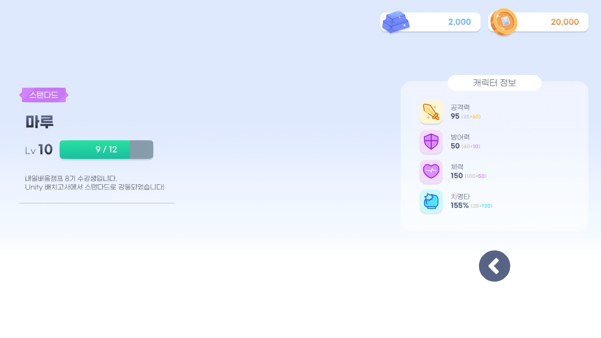

# Inventory

<!-- 프로젝트 소개 -->
## 📝 프로젝트 소개

내일배움캠프 Unity 게임 개발 심화 주차의 개인 과제 "Unity 인벤토리 구현하기" 결과물입니다.

- **에디터 버전** : 2022.3.17f1 LTS
- **렌더 파이프라인** : Built-In

[![unity][unity.com]][unity-url]
[![github][github.com]][github-url]
[![markdown][markdownguide.org]][markdownguide-url]

<!-- 구현 사항 -->
## ⚙️ 구현 사항

<!-- 필수 -->
#### ✅ 필수
|내용|자기평가|
|:---|:---:|
|||
|UI 구성하기|✔|
|스크립트 만들기|✔|
|UI 간 전환 기능 만들기|✔|
|캐릭터 정보 세팅하기|✔|
|UISlot 동적 생성하기|✔|
|Item 데이터 준비하기|✔|
|||
|객체지향을 고려한 코드 작성|✔|
|||
|ReadMe 작성|✔|

<!-- 도전 -->
#### 🔥 도전
|내용|자기평가|
|:---|:---:|
|||
|아이템 장착|✔|
|Status에 아이템 정보 반영|✔|
|||
|디렉토리 및 파일 분리|✔|
|직관적인 코드|✔|
|주석을 활용해 코드 설명|✔|
|||
|특수 상황에 대한 예외 처리|✔|
|컨벤션을 지킨 커밋 10회 이상|❌|
|모든 도전 과제 완성|❌|

<!-- 마크다운 링크 & 이미지 -->
[unity.com]: https://img.shields.io/badge/Unity-FFFFFF?style=for-the-badge&logo=unity&logoColor=black
[unity-url]: https://unity.com/kr
[github.com]: https://img.shields.io/badge/Github-222222?style=for-the-badge&logo=github&logoColor=white
[github-url]: https://github.com
[markdownguide.org]: https://img.shields.io/badge/Markdown-000000?style=for-the-badge&logo=markdown&logoColor=white
[markdownguide-url]: https://markdownguide.org